```markdown
# 🍽️ MealApplication

<p align="center">
  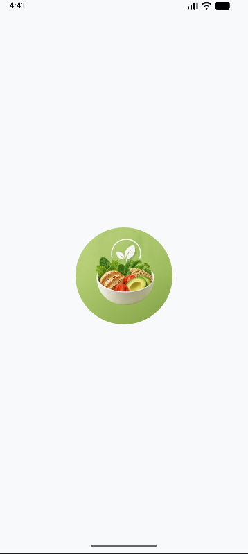
</p>

<p align="center">
  <b>Discover, explore and plan your meals — powered by TheMealDB API</b>
</p>

<p align="center">
  
  
  
  
  
  
  
</p>

---

## 📖 Overview

**MealApplication** is a fully featured Android app for discovering recipes, managing favorites and planning weekly meals — all powered by real-time data from the [TheMealDB API](https://www.themealdb.com/api.php).

Built with clean architecture in mind, it demonstrates real-world Android patterns including REST API integration, local database persistence, user authentication and dynamic UI state management.

---

## ✨ Features

| Feature | Description |
|---|---|
| 🔐 Authentication | Login & Sign Up with validation and session management |
| 🏠 Homepage | Featured recipes with filter chips (All / Vegan / Vegetarian) |
| 🔍 Search | Real-time recipe search by keyword |
| 📂 Categories | Browse all meal categories from the API |
| 📋 Recipe Detail | Full recipe info with ingredients and instructions |
| ❤️ Favorites | Save and remove meals locally with Room Database |
| 📅 Weekly Planner | Plan Breakfast, Snack, Lunch, Dinner for each day |
| 👤 Profile | View, edit name, change password, delete account, logout |

---

## 📱 Screenshots

### 🔓 Open & Authentication
<p align="center">
  
  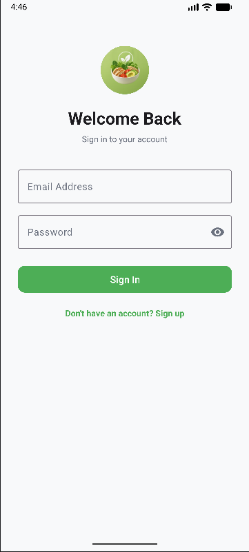
  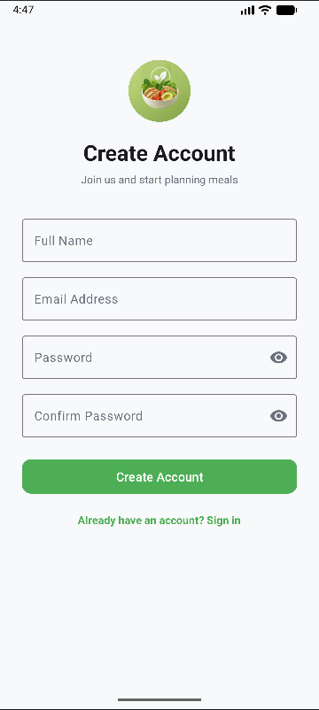
</p>

### 🏠 Homepage & Filters
<p align="center">
  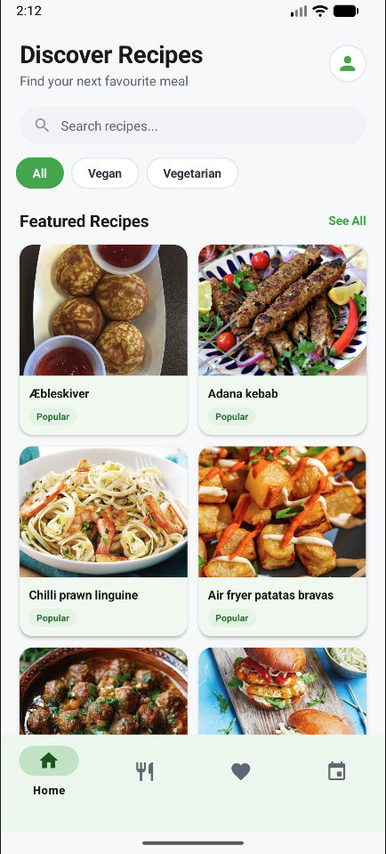
  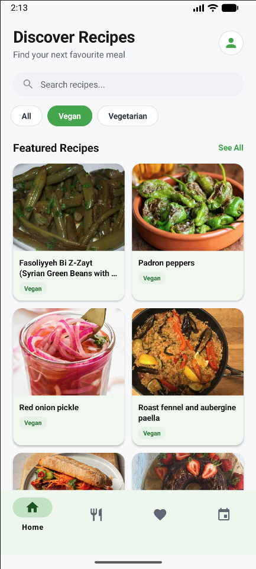
  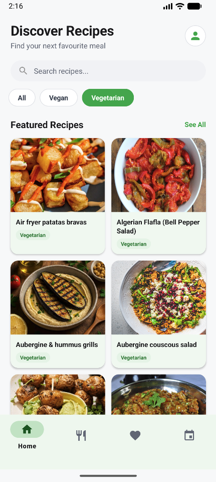
</p>

### 🔍 Search & Categories
<p align="center">
  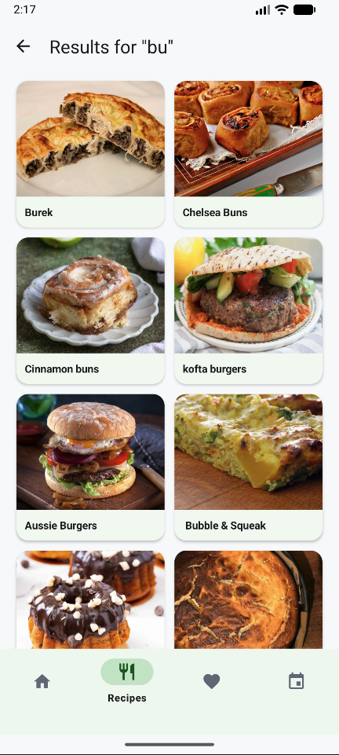
  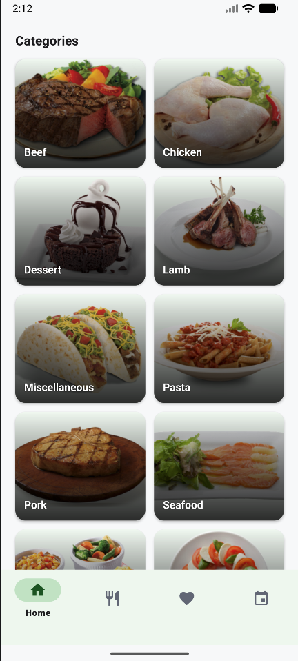
  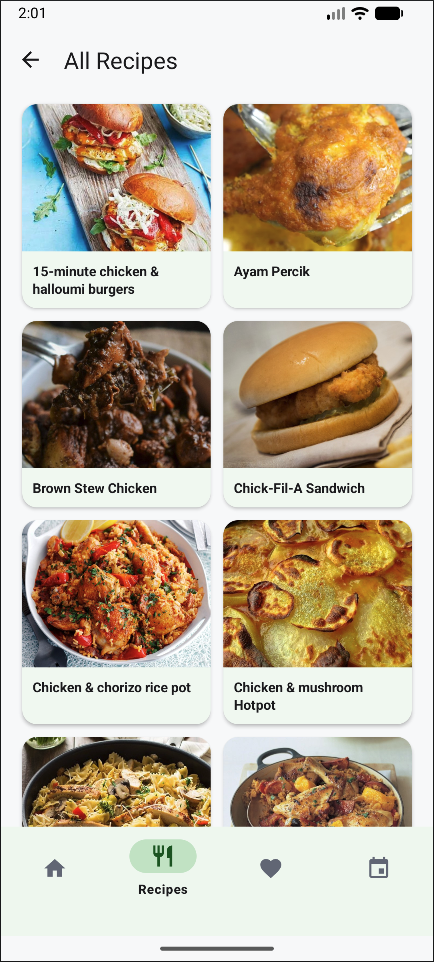
</p>

### ❤️ Favorites & Planner
<p align="center">
  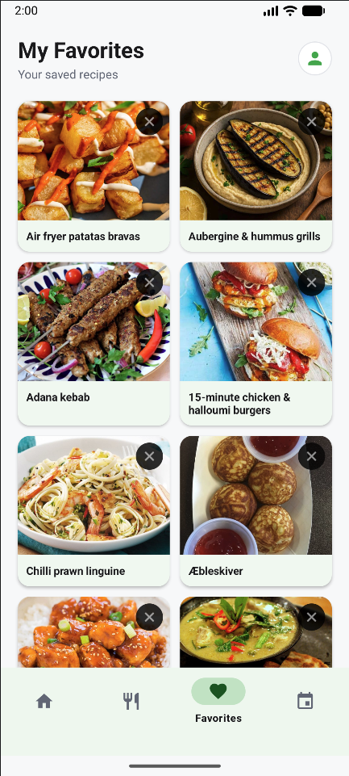
  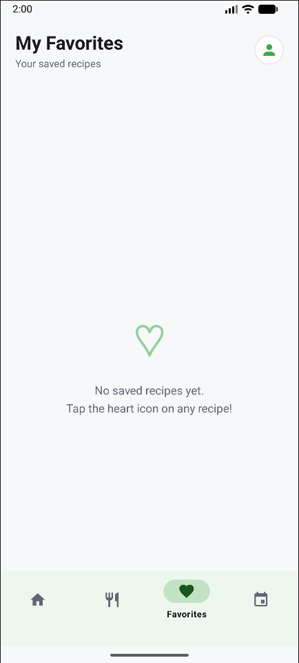
  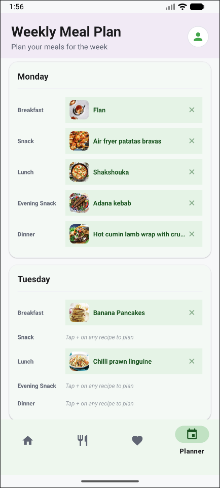
</p>

### 👤 Account
<p align="center">
  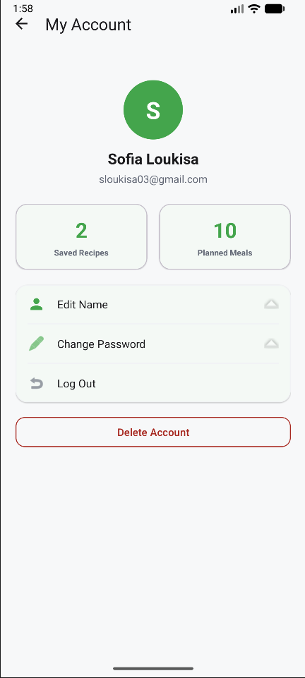
  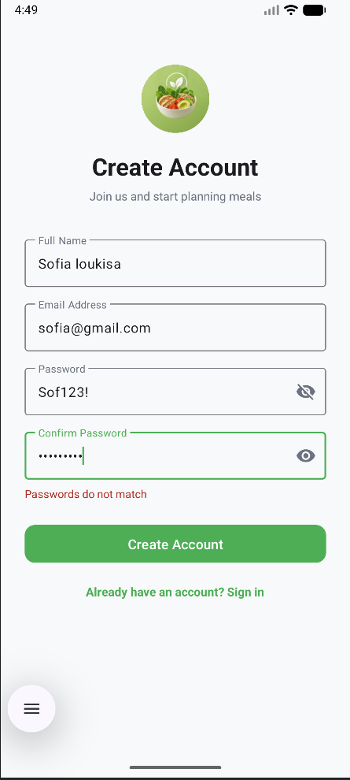
</p>

---

## ⚙️ Prerequisites

Before running this project, make sure you have the following installed:

- **Android Studio** Hedgehog (2023.1.1) or newer
- **JDK 11** or higher
- **Android Emulator** or physical device with **API 24+** (Android 7.0)
- Internet connection (required for API calls)

---

## 🚀 Installation & How to Run

**1. Clone the repository**
```bash
git clone https://github.com/SofiaLoukisa/mobile-android-java-meal-application-collaboration-project.git
```

**2. Open in Android Studio**
- Launch Android Studio
- Click `File → Open` and select the project folder

**3. Sync Gradle**
- Wait for Android Studio to sync dependencies automatically
- If prompted, click `Sync Now`

**4. Run the app**
- Select an emulator or connect a physical device
- Click the ▶️ `Run` button or press `Shift + F10`

> ✅ No API key required — TheMealDB free tier is used directly.

---

## 🏗️ Architecture & Project Structure

### UI Layer
- `ui/auth/` → LoginActivity, SignupActivity
- `ui/browse/` → BrowseActivity, CategoryAdapter
- `ui/meals/` → MealListActivity
- `ui/detail/` → RecipeDetailActivity
- `ui/favourites/` → FavoritesActivity, FavoritesAdapter
- `ui/planner/` → MealPlanActivity, MealPlanAdapter
- `ui/profile/` → ProfileActivity

### Data Layer
- `model/` → Meal, Category, MealDetail, responses
- `local/` → Room Database, DAOs, entities

### Network Layer
- `remote/` → ApiClient, ApiService (Retrofit)

### Other
- `adapter/` → MealAdapter
- `utils/` → NetworkUtils, UserPreferences

---

## 🌐 API Integration

This app uses the free **TheMealDB API**:

```
Base URL: https://www.themealdb.com/api/json/v1/1/
```

| Endpoint | Description |
|---|---|
| `filter.php?c={category}` | Get meals by category |
| `search.php?s={name}` | Search meals by name |
| `lookup.php?i={id}` | Get full meal details |
| `categories.php` | Get all categories |

### Data Flow

```
User Action → Retrofit Request → TheMealDB API
     → JSON Response → Gson Parsing → Java Object
          → Adapter → RecyclerView → UI Update
```

---

## 🛠️ Tech Stack

| Category | Technology |
|---|---|
| Language | Java |
| Platform | Android (minSdk 24, targetSdk 35) |
| Networking | Retrofit 2 |
| JSON Parsing | Gson |
| Local Storage | Room Database |
| Image Loading | Glide |
| UI Components | RecyclerView, CardView, ConstraintLayout, Material Design |
| Build System | Gradle with Version Catalogs |

---

## ⚠️ Error Handling

The app gracefully handles:
- ❌ No internet connection → error layout with **Retry** button
- ❌ Empty API responses → empty state UI
- ❌ Failed requests → user-friendly error messages
- ❌ Empty favorites list → dedicated empty state screen

---

## 🚀 Future Improvements

- [ ] Firebase Authentication
- [ ] Dark Mode support
- [ ] Nutritional information per recipe
- [ ] Shopping list generator
- [ ] Meal sharing via social media
- [ ] Smooth animations & transitions

---

## 🤝 Contributing

Contributions are welcome! If you'd like to improve this project:

1. Fork the repository
2. Create a new branch (`git checkout -b feature/your-feature`)
3. Commit your changes (`git commit -m 'Add your feature'`)
4. Push to the branch (`git push origin feature/your-feature`)
5. Open a Pull Request

---

## 🙏 Acknowledgements

- [TheMealDB](https://www.themealdb.com) — free recipe API that powers this application
- [Retrofit](https://square.github.io/retrofit/) — HTTP client for Android
- [Glide](https://github.com/bumptech/glide) — image loading library
- [Room](https://developer.android.com/training/data-storage/room) — local database persistence
- [Material Design](https://material.io) — UI components and guidelines

---

## 👩‍💻 Authors

**Sofia Loukisa** & **Anastasia Kouridaki**

---

## 📄 License

This project is developed for educational purposes and is licensed under the [MIT License](LICENSE).
```